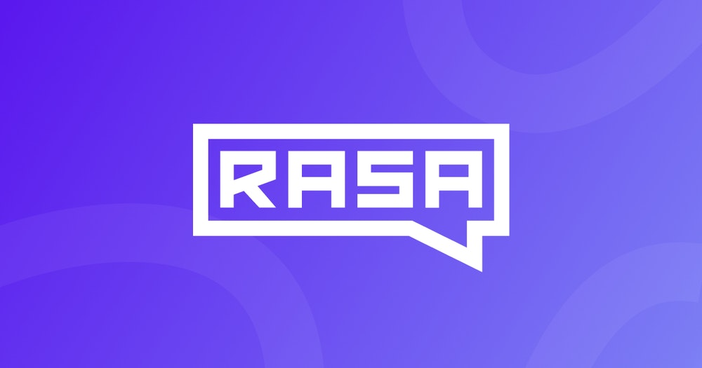

# Chatbot Project - Hotel Booking
</img>
* This project is based on the Hotel booking business use case. Using the **RASA framework (Version 3.0)**, I’ve built a chatbot that can assist the consumer to book rooms. This chatbot can store the necessary information needed for booking a room, in a MySQL database. Also, it can answer frequently asked questions regarding the hotel. eg: About the available room types, contact number, canceling policy and canceling reservation info, etc.
* “I would like to thank my mentor **Arpita Gupta mam** and **“Let the data confess”** company for this wonderful opportunity and guiding me and my teammate Aswin Kumar to complete this project.” 

## Nlu.yml file:
In the nlu.yml file, I've created the necessary intents and entities, provided appropriate examples for them to train.

## Rules.yml file:
In rules.yml file, 4 rules were created:
* To say goodbye anytime the user says goodbye.
* To say “I’m a bot” if bot_challenge intent is triggered.
* To activate the hotel booking form when the hotel_booking intent is triggered.
* Submit form, to confirm the details collected from the user.

## Stories.yml file:
* The primary use of the Stories.yml file is to provide the conversational flow to our bot. 
* A title is given for each story, and appropriate intents and actions are provided below them, thus designing the conversational flow.

## Domain.yml file:
The Domain file is a directory of everything the assistant knows: 
* Responses: These are the things the assistant can say to users.
* Intents: These are the category of things user say.
* Slots: These are variables remembered over the course of a conversation.
* Entities: Pieces of information extracted from incoming text.
* Forms and Actions: These add application logic and extend what our assistant can do.

## Config.yml:
* NLU pipeline and dialogue configuration are the core of our assistant. 
* I’ve used Duckling Entity extractor for extracting email and phone number from the user input to store them in the slot, which runs at http://duckling:8000.

## Endpoints.yml file:
* This file contains the different endpoints our bot can use. The action endpoint is given to http://action-server:5055/webhook , the server in which the action file runs.

## Credentials.yml:
* This file contains the credentials for the voice & chat platforms. For connecting our bot to different channels such as Telegram, slack etc. Here, the access token, the name of the bot to verify and the webhook URL to connect to the channel, which should be HTTPS secured one.

## Actions.py file:
* In this file we can add customized actions for our bot, to store the information collected from the user in a database, I’ve created a function ‘DataUpdate’ which connects with MySQL and saves it in the database.
* Secondly, created a class ValidateBookRoomForm which inherits the FormValidationAction via rasa sdk api, which we imported earlier in the file. In this class, we're validating the slots one by one using Python.
* Finally, ActionSubmit class is made which inherits the Action from rasa sdk, here, we call the data update function to store the information collected using the slots, and a message for the user is uttered.

## Deployment phase: (Errors and solutions are mentioned):
* I’ve used Docker and Google Cloud Platform for the deployment part. Docker allows the applications to be packaged as containers, which enables us to separate our applications from the infrastructure.
* Google cloud virtual machine is created, and a ssh key is generated for it using putty and connected. The files have been transferred from the local machine to GCP by using WinSCP.
* The files are arranged as the below image shows, where inside actions folder lies the action.py file and a Docker file to install the dependencies such as mysql connector.

* Inside Backend folder, the models trained, the nlu, rules, stories and all the rest of the files are there. Another docker file inside the backend consists of the commands which is to be run in the backend. Eg: --enable api, -- cors, --debug etc.
* Now in the docker-compose.yml file, we have created three containers for Nginx, rasa_server and Action_server respectively and their server ports were mentioned. Duckling is also mentioned, since we’re using it.Downloaded docker and MySQL in GCP, and other necessities inside a virtual environment.

## REFERENCES:
* https://datahive.ai/deploying-rasa-chatbot-on-google-cloud-with-docker/
* https://stackoverflow.com/questions/11583562/how-to-kill-a-process-running-on-particular-port-in-linux 
* https://serverfault.com/questions/896711/how-to-totally-remove-a-certbot-created-ssl-certificate  - To remove ssl certificate

